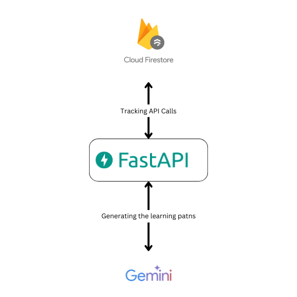
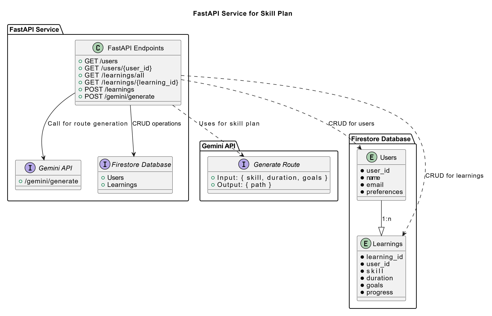
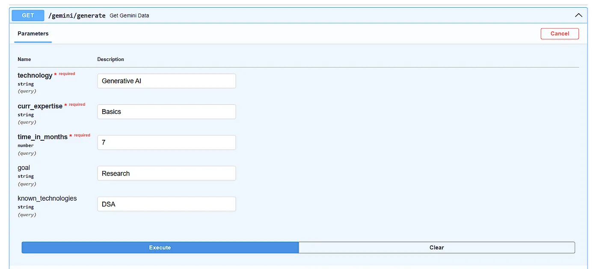

Starting a new skill should be exciting — but too often, it feels overwhelming, with scattered resources and no clear path. Frustrating, right?

# Imagining the Possibilities💡

Now, picture this: learning made effortless, focused, and inspiring.

Say hello to the future of growth — a revolutionary learning path system designed to adapt to your dreams:

- Personalize your journey to match your goals.
- Track your progress with clarity and ease.
- Discover curated resources tailored just for you.
- Celebrate every milestone as you grow.

It’s time to learn smarter, faster, and with purpose. Together, let’s transform how you achieve your goals.

# What Did We Create?🤔

We built something powerful:

- A FastAPI backend powered by Gemini AI to craft personalized learning paths.
- A smart progress tracker using a custom database schema to keep you on course.
- Seamless, scalable tech with Firebase and FastAPI, delivering a solution that’s fast, intuitive, and empowering.

This isn’t just another tool — it’s your ultimate growth companion, built to inspire and elevate.

# Building Blocks of Innovation: The Architecture Behind Skill Starter



- FastAPI: Core backend for user requests, path generation, and tracking.
- Cloud Firestore: NoSQL database for real-time data storage.
- Gemini: User-facing platform to access personalized paths.

# Steps to Implement the System

Create Credentials for Gemini and Firebase: Establish secure credentials and API keys for Gemini and Firebase, ensuring smooth integration and robust authentication for all interactions.

Refine Prompt for Precision: Enhance input queries to deliver highly accurate and relevant responses. Focus on aligning prompts with desired outcomes to optimize data retrieval and performance.

Develop the API: Build a reliable and scalable API to fetch and deliver data efficiently. Design endpoints to integrate seamlessly with Gemini and Firebase, ensuring consistency and reliability.

```
import google.generativeai as genai
genai.configure(api_key=os.environ.get('GEMINI_API_KEY'))
model = genai.GenerativeModel("gemini-1.5-flash")

```

<pre>
<code>
@router.get("/gemini/generate")
async def get_gemini_data(technology: str,curr_expertise:str, time_in_months: float, goal: Optional[str] = "", known_technologies: Optional[str] = ""):
    prompt = f'''<your prompt😅>'''
    # TODO: add history if specified
    chat = model.start_chat()
    response = chat.send_message(prompt)
    return json.loads(response.text)
</code>
</pre>
Set Up the Database: Create a well-structured, secure database optimized for fast queries and scalability. Prioritize data integrity and secure storage for long-term reliability.

from firebase_admin import firestore, initialize_app, credentials
import os
<pre>
<code>

cred = credentials.Certificate('<Your credential JSON>')

initialize_app(cred)
db = firestore.client()

user_collection = db.collection('users')
learning_collection = db.collection('learnings')
Connect API Services and Database: Integrate API endpoints with the database to enable seamless communication and real-time data synchronization across the system.

</code>
</pre>
# Visualizing the Blueprint: UML Diagram of Skill Starter


# Result

```
{
  "learning_path_name": "Generative AI Research Path",
  "learning_path_description": "A 7-month structured learning plan for beginners aiming to conduct research in Generative AI.",
  "due_date": "2024-04-26",
  "status": "pending",
  "tasks": [
    {
      "task_name": "Fundamentals of AI and ML",
      "task_deadline": "2023-11-26",
      "duration_period": "4 weeks",
      "task_description": "Gain foundational knowledge of AI and Machine Learning concepts.",
      "status": "pending",
      "scorePoints": 100,
      "goals": [
        "Understand basic AI concepts",
        "Grasp fundamental ML algorithms"
      ],
      "subtasks": [
        {
          "status": "pending",
          "subtask_name": "Linear Algebra and Calculus",
          "subtask_deadline": "2023-10-26",
          "duration_period": "2 weeks",
          "subtask_description": "Learn essential math for AI/ML",
          "subtask_goals": [
            "Master linear algebra basics",
            "Understand calculus concepts relevant to ML"
          ],
          "reference_links": [
            {
              "reference_name": "Khan Academy Linear Algebra",
              "reference_link": "https://www.khanacademy.org/math/linear-algebra"
            },
            {
              "reference_name": "Khan Academy Calculus",
              "reference_link": "https://www.khanacademy.org/math/calculus-home"
            }
          ]
        },
      ]
    },
    ...
  ]
}
```
[for tracking schema visit the github…](https://github.com/ShaikRiyaz2003/TechExplorationAcademy/blob/main/models/user_model.py)

# Wanna Try it?
- Visit Visit [SkillStarter](https://github.com/ShaikRiyaz2003/TechExplorationAcademy) and clone using the following cmd
```
git clone https://github.com/ShaikRiyaz2003/TechExplorationAcademy
cd TechExplorationAcademy
```
- create a virtual environment and install dependencies
```
python -m venv env
env/Scripts/activate
pip install -r requirment.txt
```
- Run the server on a Port
```
uvicorn main:app --reload --port <PORT>
```
- Visit http://localhost:<PORT>/docs and happy learning

# Future Plans
- Frontend for Client Interaction: Delight clients with an intuitive, seamless interface.
- Automated Resume Crawler: Supercharge job searches with intelligent automation.
- Streak Feature: Ignite motivation with powerful streak tracking.
- Job Recommendations Post-Skill Completion: Unlock tailored opportunities with every skill mastered.
- Crack the Job Opportunity Plan: Dominate your career goals with a winning strategy.


To learn more about Google Cloud services and to create impact for the work you do, get around to these steps right away:

- Register for Code [Vipassana sessions](https://rsvp.withgoogle.com/events/cv)
- Join the meetup group [Datapreneur Social](https://www.meetup.com/datapreneur-social/)
- Sign up to become Google [Cloud Innovator](https://cloud.google.com/innovators)

Thanks for reading this article☺️.

A heartfelt thanks to [Praneeth](https://www.linkedin.com/in/praneeth1513/) for the dynamic collaboration and to [Abirami](https://www.linkedin.com/in/abiramisukumaran/) for the inspiring mentorship that elevated the entire process.

Discover more game-changing insights💡🎯 and stories — connect with me on [LinkedIn](https://www.linkedin.com/in/shaikriyaz03/), [GitHub](https://github.com/ShaikRiyaz2003), and [Medium](https://medium.com/@shaikriyaz2003)!

